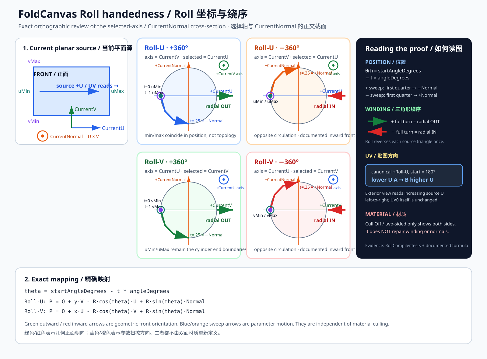

# Roll handedness review / Roll 坐标与绕序审查



This review is derived from the maintained Circular Roll equation and tests. It
is not a rendered Mesh, a material workaround, or an alternative compiler
contract.

本页直接由项目维护的圆形 Roll 公式与测试推导。它不是 Mesh 渲染截图，不是
材质补丁，也没有另行定义编译器行为。

## Fast reading / 快速读图

For normalized selected coordinate `t` from the selected minimum boundary to
its maximum boundary:

```text
theta = startAngleDegrees - t * angleDegrees
```

- Roll-U selects source U, bends it around an axis parallel to `CurrentV`, and
  uses the `CurrentU`/`CurrentNormal` radial plane.
- Roll-V selects source V, bends it around an axis parallel to `CurrentU`, and
  uses the `CurrentV`/`CurrentNormal` radial plane.
- At `startAngleDegrees = 0`, the minimum boundary starts at the negative
  selected-axis radial direction. A positive quarter turn reaches
  `-CurrentNormal`; a negative quarter turn reaches `+CurrentNormal`.
- The executor reverses every selected source triangle once. A positive full
  turn is radially outward; a negative full turn has the documented radially
  inward front orientation.
- Roll preserves source UVs and named-boundary order. For the canonical
  positive Roll-U exterior proof at `startAngleDegrees = 180`, increasing
  source U reads left-to-right.

- Roll-U 选择源 U，绕平行于 `CurrentV` 的轴卷曲，径向平面由
  `CurrentU` 与 `CurrentNormal` 构成。
- Roll-V 选择源 V，绕平行于 `CurrentU` 的轴卷曲，径向平面由
  `CurrentV` 与 `CurrentNormal` 构成。
- 当 `startAngleDegrees = 0` 时，最小边界从所选轴的负径向开始。正四分之一圈
  到达 `-CurrentNormal`，负四分之一圈到达 `+CurrentNormal`。
- 执行器会把目标面板的每个源三角形绕序反转一次。正完整一圈的几何正面朝
  径向外，负完整一圈按合同朝径向内。
- Roll 保留源 UV 与命名边界顺序。规范正 Roll-U 外部视图在
  `startAngleDegrees = 180` 时，递增的源 U 从左向右可读。

## Source boundaries / 源边界

Rectangle boundary order remains source-authored:

- `uMin` and `uMax`: bottom-to-top;
- `vMin` and `vMax`: left-to-right.

A complete turn may make the selected minimum and maximum boundary positions
coincide, but their render vertices and topology remain separate until an
explicit Stitch selects their seam.

完整一圈可以让所选最小/最大边界的位置重合，但渲染顶点与拓扑仍然分离，只有
后续显式 Stitch 选择相应 Seam 才会焊接。

## Claim-to-evidence map / 声明与证据

| Claim ID | Review claim | Maintained evidence |
|---|---|---|
| ROLL-FORMULA | Signed parameter motion follows the one implemented theta equation. | [`foldscript-field-reference.md`](../../../Documentation~/foldscript-field-reference.md#63-roll--implemented-in-m03), [`compiler-pipeline.md`](../../../Documentation~/compiler-pipeline.md#m03-current-frame-roll), and `Runtime/Compiler/RollExecutor.cs` |
| ROLL-U-AXIS | Roll-U uses `CurrentV` as its cylinder axis and reaches `-CurrentNormal` at the positive first quarter. | `RollU_And_RollV_HaveDocumentedHandedness` |
| ROLL-V-AXIS | Roll-V uses `CurrentU` as its cylinder axis and reaches `-CurrentNormal` at the positive first quarter. | `RollU_And_RollV_HaveDocumentedHandedness` |
| POSITIVE-WINDING | Positive full Roll is radially outward after the deterministic winding reversal. | `PositiveFullRoll_HasOutwardWinding` |
| NEGATIVE-WINDING | Negative full Roll reverses radial orientation predictably. | `NegativeFullRoll_ReversesOrientationPredictably` |
| UV-READABILITY | Canonical positive Roll-U exterior view reads increasing source U left-to-right. | `PositiveRoll_CanonicalExteriorReadsSourceUFromLeftToRight` |
| MATERIAL-SEPARATION | UV preservation and triangle winding are geometry/compiler facts; two-sided rendering only changes which sides the renderer displays. | Roll formula plus `Roll_PreservesSourceUvProvenanceTopologyAndBoundaries` |

## Winding is not culling / 绕序不等于双面材质

`Cull Off` or another two-sided material setting can make both triangle sides
visible. It does not repair triangle winding, change the geometric front,
reverse normals, or make an inward negative Roll outward. Geometry tests must
pass with one-sided interpretation; a two-sided material is presentation only.

`Cull Off` 或其他双面材质只能让三角形两面都可见。它不会修复三角形绕序、
改变几何正面、反转法线，也不会把朝内的负 Roll 变成朝外。几何验收必须按单面
语义成立；双面材质只属于显示层。

## Reproduce the review / 复核方法

The SVG is hand-authored from repository equations using only local vector
primitives and generic system fonts. It embeds the four signed-sweep contracts
as review metadata. Validate it without Unity or network access:

```bash
python3 Scripts/validate_roll_handedness_review.py
python3 Scripts/test_roll_handedness_review.py
```

For executable geometry evidence, run the named tests in
`Tests/Editor/RollCompilerTests.cs` with Unity `6000.3.20f1`.

SVG 只使用仓库内的矢量图元与通用系统字体，并把四种有符号扫掠合同作为审查
元数据写入文件。静态验证不需要 Unity 或网络；实际几何证据由上述 Edit Mode
测试提供。
