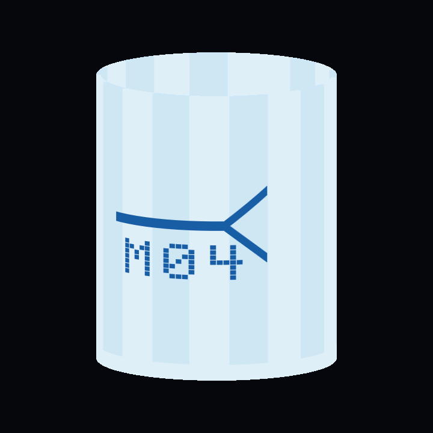
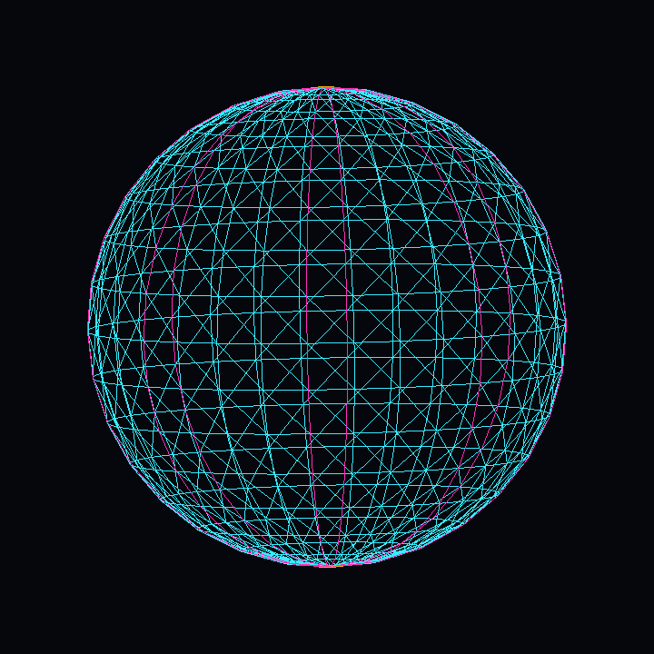

# FoldCanvas proof gallery evidence

These images are derived evidence, not geometry source. The authoritative
inputs remain the tracked 2D canvas and FoldScript named in
[`manifest.json`](manifest.json).

## Cup

| 2D source | Textured closed result | Logical topology |
| --- | --- | --- |
|  |  |  |

The manifest records one closed component, zero open edges, zero non-manifold
edges, zero orientation conflicts, and positive volume for the compiled cup.

## Eight-gore sphere

| 2D source | Textured closed result | Logical topology |
| --- | --- | --- |
|  |  |  |

The manifest records eight spherical panels, Euler characteristic `2`, zero
open edges, zero non-manifold edges, zero orientation conflicts, zero inward
triangles, and one north/south topology pole.

## Regeneration

Use Unity `6000.3.20f1` with a real graphics device:

```sh
python3 Scripts/generate_proof_gallery.py \
  --unity /path/to/Unity.app/Contents/MacOS/Unity
```

The wrapper creates a disposable clean Unity host from
`Scripts/Templates~/M21ProofGallery`, copies only maintained source inputs,
compiles them through the package Runtime API, and accepts only the seven
expected evidence files. It does not use `Project~`, an existing scene, a Unity
primitive sphere, Blender, ImageGen, or a manually repaired Mesh.

Validate the source, geometry claims, tool hashes, PNG structure/content,
dimensions, and all SHA-256 values with:

```sh
python3 Scripts/validate_proof_gallery.py
python3 Scripts/test_proof_gallery.py
```

The package-root README intentionally does not embed this gallery in M21. It is
part of the UPM archive; gallery integration therefore belongs to a separately
versioned patch release. Published `v1.0.0` and RC2 assets remain immutable.
