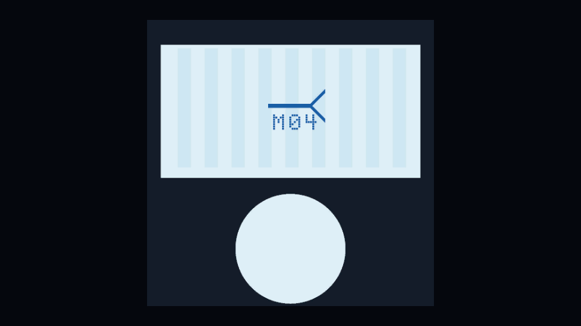
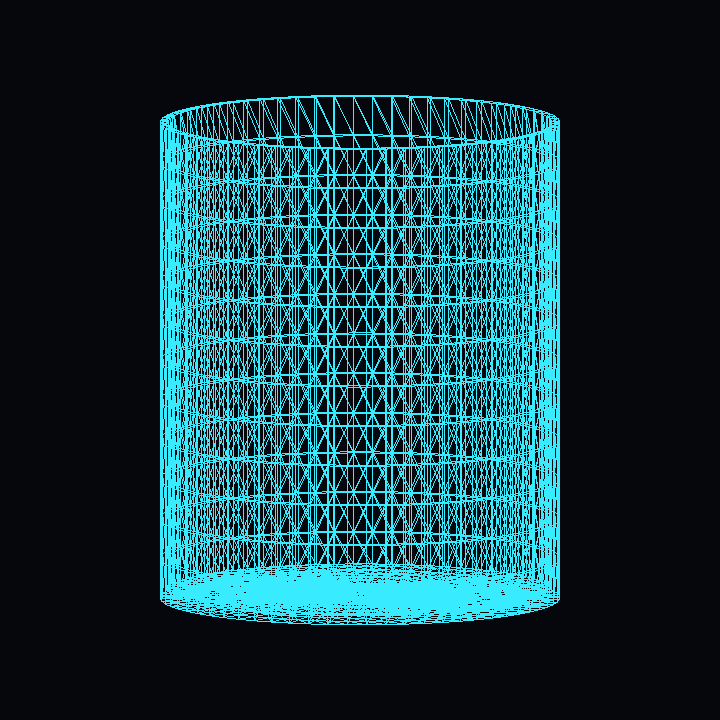
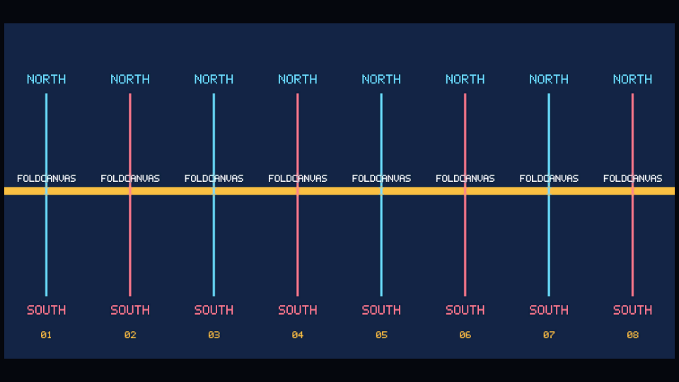
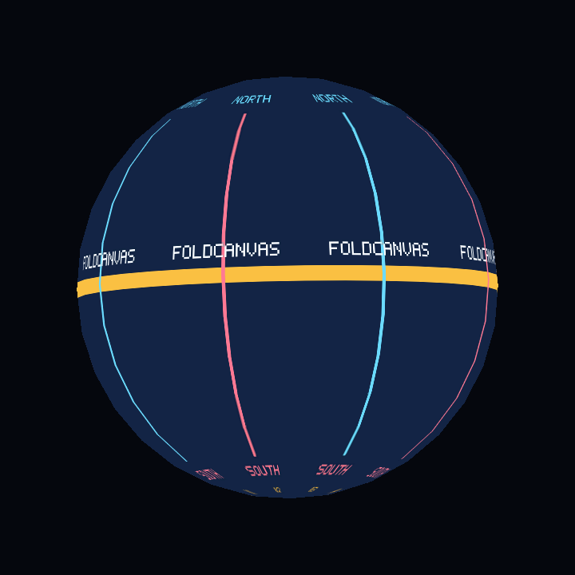

# FoldCanvas

> **FoldCanvas 1.1.0 次版本。** 一个面向 Unity 的“二维优先、确定性编译”三维
> 曲面引擎；M25 为 M24 的向后兼容离网格 Fold 能力分配精确 `v1.1.0` 身份，
> 不可变的 `v1.0.1` 作为回退版本。

**二维画布 + FoldScript -> 确定性三维几何。** 下面不是 Unity 原始体、库存模型
或生成式宣传图，而是由维护中的源资产通过 Unity `6000.3.20f1` 实际编译、渲染
的结果。点击图片可查看原图；[证据清单](https://github.com/zhangpan-soft/FoldCanvas/blob/main/Docs/Community/ProofGallery/manifest.json)
与[复现说明](https://github.com/zhangpan-soft/FoldCanvas/blob/main/Docs/Community/ProofGallery/README.md)记录了源文件、工具、几何、
拓扑和 SHA-256。

### 闭合杯体：二维源 -> 贴图结果 -> 逻辑拓扑

| 权威二维源 | 编译后的贴图杯体 | 闭合体拓扑 |
| --- | --- | --- |
| [](Documentation~/ProofGallery/cup-source.png) | [](Documentation~/ProofGallery/cup-textured.png) | [](Documentation~/ProofGallery/cup-topology.png) |

维护中的[生产杯 FoldScript](Samples~/BootstrapPanel/m12-production-cup.foldcanvas.json)
会得到一个闭合组件：开放边、非流形边、方向冲突边都是 `0`，并且体积为正。

### 八瓣球体：二维源 -> 贴图结果 -> 接缝拓扑

| 八块显式二维球瓣 | 编译后的贴图球体 | 闭合球拓扑 |
| --- | --- | --- |
| [](Documentation~/ProofGallery/sphere-source.png) | [](Documentation~/ProofGallery/sphere-textured.png) | [](Documentation~/ProofGallery/sphere-topology.png) |

维护中的[球体 FoldScript](Samples~/Sphere/sphere-golden.foldcanvas.json)包含八个面板，
欧拉特征为 `2`，开放边、非流形边、方向冲突边都是 `0`，三角形朝外。
[`1280 x 640` 社交预览候选图](https://github.com/zhangpan-soft/FoldCanvas/blob/main/Docs/Community/ProofGallery/social-preview.png)
也只使用了这组已经审计的真实像素。

## 为什么要做这个引擎

这个项目来自“只用 AI 创建 3D 游戏”时遇到的一个直接瓶颈：AI 已经很擅长
二维原画、纹理、贴花和图案设计，但直接生成的三维模型仍经常出现拓扑混乱、
UV 不可控、比例漂移、厚度错误、接缝不闭合、难以修改，以及相同提示无法
稳定复现等问题。外观看起来像一个物体，并不等于它已经是可进入游戏生产
管线的资产。

FoldCanvas 的思路是把 AI 擅长和不擅长的部分拆开：

- AI 或人类负责二维画面，以及可读、可校验的结构化构造意图；
- 确定性几何编译器负责顶点、拓扑、UV、接缝、厚度和诊断；
- 同一份二维源与配置可以反复生成相同的三维结果，而不是每次重新“猜”模型。

因此项目要解决的不是“再做一个文生 3D 接口”，而是给 AI 游戏开发提供一种
可编程、可审查、可测试、可版本控制的 3D 资产源格式。

完整背景见[《为什么创建 FoldCanvas》](Documentation~/project-background.md)，
资产配置每个字段（包括 `roll`）的精确定义见
[《FoldScript JSON 字段参考》](Documentation~/foldscript-field-reference.md)。

FoldCanvas 不把 Mesh 当作源文件，而把它视为编译产物：

```text
三维资产 = 二维画卷 + 面板 + 接缝 + 折叠程序 + 厚度
```

用户在二维画布中完成外观、区域和结构描述，编译器再确定性生成 Unity `Mesh`、材质绑定、诊断信息，后续继续生成 Collider、LOD 和 Prefab。

这不是给现有文生 3D 套一层壳。核心几何不依赖任何 AI 服务。AI 未来只负责生成或修改可读、可校验的 FoldScript，而不是直接吐出无法维护的三角形团。

## 当前已经实现的内容

- 标准 Unity Package Manager 包结构
- 可序列化的二维源资产模型
- 经过输入校验的矩形与圆盘/椭圆面板离散化
- 原始二维坐标与画布 UV 全程保留
- 不可变的编译结果、面板归属、来源编号和有序边界
- 顶点/三角形生成上限，危险细分会在分配内存前报错
- 按顺序执行的刚体变换操作
- 按顺序执行的刚性折线 `Fold`，正负角度方向已有明确合同
- 折线会从二维源确定性映射到面板当前的三维表面
- 直线型、边界到边界的矩形 off-grid 折痕会先在二维源域确定性切分三角形，
  精确保留 UV 与命名边界顺序，再执行刚性折叠
- 缺失目标、非法折线、非零 falloff、弯曲/含糊铰链都有稳定诊断码
- 在目标当前全等平面框架中执行 Circular Roll，正负手性与外法线已有明确合同
- Seam 声明只有被显式 Stitch 选择后才执行；Weld 后逻辑拓扑共享
  `TopologyVertexId`，UV/来源不同的渲染顶点仍可保留
- 不等采样边界按当前空间弧长确定性重采样，缺失采样点会真实拆分相邻三角形
- 可复用的 Weld 与 Bridge
- `inward`、`outward`、`centered` 三种 Solidify 厚度方向，焊接硬角共享
  miter，内壳反向绕序，并且只在真实开放边生成侧壁
- 一张含六个不同区域的二维画布可以编译成带图案盒体
- 杯壁侧缝和杯底圆周真实拓扑焊接；加厚后内角连续，杯口 rim 完整闭合
- 明确声明的矩形二维球瓣可通过 `SphericalWrap` 的半径、经纬范围、方向、
  极点与细分字段映射到球面
- 球面接缝插点会重新执行球面公式，极点拥有明确逻辑拓扑，最终用欧拉特征、
  边关联、绕序和半径误差验证真正闭合
- 只有球面到球面的接缝用于形成组件；任何一端命中该组件的后续 Stitch 都会推迟
  报告，组件只在最后一个触碰 Stitch 之后、相关 Solidify 之前独立生成报告
- 所选球面端点必须先执行 SphericalWrap、再执行 Stitch；非法顺序会在面板离散前
  返回 `FC2010`，不会生成提前或过期的球面报告
- 面板离散、Stitch 插点/Bridge 与 Solidify 内外壳/rim 共用同一份累计几何预算
- 一张包含 `NORTH`、`FOLDCANVAS`、`SOUTH`、赤道与球瓣编号的二维画布，
  可以在不调用 Unity 球体原语的情况下重建为闭合球体
- 稳定的编译诊断与确定性验证
- Unity Editor Mesh 烘焙工具
- UI Toolkit 二维源画布 / 三维派生预览分栏工作区
- 矩形与圆盘创建、画布区域拖拽、命名边界与接缝配对、显式操作表单、
  结构化诊断定位、Undo/Redo、防抖编译、调试叠加和仅限有效结果的 Bake
- Basic、Standard、Strict 三级累计终态几何验证，并且根因诊断顺序稳定
- 诊断可定位到边界、渲染/逻辑顶点、组件、三角形对和逻辑边，完整报告只读
- Strict 先做确定性宽相位，再对不共享逻辑顶点的三角形执行精确相交检查；
  宽相位候选不会被冒充成已经确认的碰撞
- 弓形拓扑点、重复面、翻面、开放接缝、零长度边界、自交卷面与厚度重叠等
  对抗性夹具，以及合法杯体/球体的防误报回归
- 可执行且有输入上限的 FoldScript `0.1` 导入/导出：显式 DTO、严格字段与引用
  校验、安全外观路径，以及米/厘米/毫米到原生米制的明确转换
- 固定字段顺序、与区域设置无关的确定性 Canonical JSON；面板、Seam、操作数组
  保留源作者顺序
- 与厂商无关且集合只读的提案/修复合同与紧凑诊断载荷；修复结果只能以完整
  FoldScript 重新进入普通导入器和编译器，核心包不依赖模型 SDK 或网络
- M06 工作区新增 Import JSON、Export JSON、Copy Repair Payload，并提供显式
  资产归属、覆盖 Undo 与失败导入不污染目标的保证
- BoundaryReference 可选择归一化、非环绕的边界区间；离网格端点会确定性拆分
  真实的边界相邻源三角形，不会生成悬空渲染点
- `ToroidalWrap` 可把一个明确的二维矩形参数面板映射为环面曲面，保留当前局部
  框架、正负主/次角范围、向外绕序，并且只允许显式 Weld 关闭周期
- 一个二维矩形与两条显式闭合 Seam 可生成欧拉示性数为 0 的闭合环面；两个
  UV 属性接缝仍保留各自二维来源的渲染顶点
- 杯把使用普通矩形条、刚体定位、两次网格对齐 Fold、两个杯口边界区间 Weld
  和最终 Solidify，与杯体形成单一闭合连通体，不使用导入 Mesh 或布尔运算
- 每次编译显式传入的贡献者操作注册表；自定义操作只能修改一个现有面板的有限
  顶点位置，失败完整回滚，不能改三角形、拓扑、边界、UV、来源或几何预算
- 带版本且有输入上限的样例 Gallery，以及可直接编译的自定义操作模板
- 确定性 OBJ 文本导出、固定场景性能证据、字节可复现且仅包含白名单内容的 UPM
  发布压缩包
- 固定六条目、无压缩、时间戳归一化的 `.foldcanvas.zip` 生产交付包；只有规范化
  FoldScript 与原始 PNG 是源，OBJ 和完整编译/验证报告都是派生证据
- 把交付包当作不可信输入，在写入 `Assets/` 前完成路径、链接、大小、哈希、版本、
  PNG 尺寸、内存编译、OBJ 与完整证据比对
- 接收项目获得可编辑源资产、单面纹理材质、Mesh、运行时 Prefab 和归属回执；
  同一完整交付包重复导入不写文件，派生产物可从二维源重新生成
- 两个独立干净 Unity 工程只传递交付 ZIP，并强制比较源、几何、OBJ、诊断、验证、
  闭合体、回执和包版本证据
- Edit Mode 测试
- 完整架构、FoldScript 规格、路线图与 Codex 分阶段提示词

首个公开证明目标是：一张二维图片同时包含杯底、杯壁、文字与 Logo，经过 FoldScript 编译后得到闭合、有厚度、图案正确的三维杯子。

M04 保留 M03 Circular Roll 的一圈限制与全等平面框架合同，并已实现通用
边界重采样、Weld、Bridge、内外壳、硬角 miter 与开放边 rim。重采样不会
生成悬空点，而会拆分相邻源三角形并插值二维坐标和 UV。Stitch 之后，在共享
拓扑变形传播实现前，不能再单独移动其已选择面板；Solidify 可以在 Stitch
之后消费完整焊接拓扑。

M05 不是新增一个“球体生成器”。八个矩形球瓣先从二维源域确定性离散，再在
各自当前全等平面框架中执行 `SphericalWrap`，最后只依据显式 Seam Graph 和
终端 `Stitch` 焊接。接缝新增采样点会重新落在球面公式上，而不是停留在球内
弦线上；最终必须满足单一连通分量、零开放边、零非流形边、向外绕序、欧拉
示性数 2，以及南北极各一个逻辑拓扑点。
这份零厚度报告会在组件最后一个触碰 Stitch 后、任何命中该组件的 Solidify
之前固定下来。球面到普通面板的 Bridge/Weld 也属于触碰操作，不能保留更早的
旧报告。球面专属报告本身不执行全局 triangle-triangle 自相交检测，因此单独
看到闭球报告不等于对任意几何“绝无自交”的完整证明；当
`validationLevel=strict` 时，后续 M07 终态报告会补充确定性的精确非邻接
三角形相交证据。

M06 让同一套源数据不再必须通过代码创建。执行
`Tools > FoldCanvas > Open Authoring Workspace`，即可在左侧编辑二维面板和
接缝，在右侧查看由编译器生成的三维结果，并在下方编辑操作、查看诊断和显式
Bake。预览对象只是 Editor 内可销毁的派生产物，不会取代源资产。完整步骤见
[《M06 工作区：从空白源到闭合杯子》](Documentation~/authoring-workspace.md)。

M07 只读取并验证最终显式几何缓冲，不会替用户改 Mesh。Basic 负责结构安全；
Standard 增加逻辑拓扑、边界、已执行 Weld、组件和闭合绕序；Strict 再增加
精确三角形相交检查。故意开放的薄片或多零件资产仍可成功，只产生警告。完整
合同见[《M07 几何验证》](Documentation~/geometry-validation.md)。

M08 把 FoldScript `0.1` 变成真正可执行、可移植的源合同。Runtime 对不可信 JSON
先做有上限的解析，再校验全部字段、ID 与引用，按声明单位转成原生米制，并输出
字节稳定的 Canonical JSON。Editor 可以导入/导出明确的项目资产；外部 AI 集成
只能读取只读修复载荷并返回完整替换 FoldScript。核心包本身不会登录模型服务、
发网络请求或自动接受修复。完整合同见
[《M08 FoldScript Runtime 与 Editor 工作流》](Documentation~/foldscript-runtime.md)。

M09 用可审查的二维源证明非平凡环状拓扑。`ToroidalWrap` 只负责把矩形参数域
映射到环面位置，主环与管环仍必须分别通过声明的 Seam 和 `Stitch` Weld；位置
重合不会自动改变拓扑。边界引用新增归一化非环绕区间，因此杯把可以继续使用
普通矩形条，通过既有 RigidTransform、两次 Fold、两个杯口连接区间、终端
Stitch 与最终 Solidify 生成。Mesh 仍可随时删除重编，完整说明见
[《M09 非平凡拓扑样例》](Samples~/Topology/README.md)。

M10 在不暴露内部拓扑缓冲的前提下开放一个受限贡献入口：调用方只为本次编译
显式注册原生自定义操作，扩展只能改一个现有面板的有限位置。UV、来源、三角形、
边界、逻辑拓扑和几何预算全部保持不变。Gallery、OBJ、性能报告和发布包仍是可
重建派生产物；FoldScript `0.1` 仍拒绝未知操作。完整合同见
[《M10 扩展与生态》](Documentation~/extensibility.md)，可编译模板见
[OperationExtension](Samples~/OperationExtension/README.md)。

M11 把验收标准从“在仓库自带工程里能运行”提升到“发布压缩包能在全新的 Unity
工程中被普通使用者安装和调用”。两个独立宿主会安装同一个 `.tgz`，只通过公开
`FoldCanvas.Runtime` 编译消费者代码，并比较包、源、几何、OBJ 与诊断证据。
同时加入实际编译程序集生成的公共 API 基线，以及平面、厚杯、球瓣、环面、注册
扩展、预期失败六类生产语料。原生扩展属于受信任的进程内代码，不是安全沙箱。
完整合同见[生产可用证据](Documentation~/production-readiness.md)与
[兼容和迁移策略](Documentation~/compatibility.md)。M11 不新增几何类型，也不
提前发布 1.0。

M12 把已经验证过的包扩展成真正的资产交付流程。`Tools > FoldCanvas > Handoff`
可以导出确定性的源优先压缩包；接收方先在内存中完成有上限的校验和重新编译，
然后才创建一个明确的新 `Assets/` 子目录。Mesh、OBJ、Prefab 与回执仍是派生物，
Unity GUID 归接收项目所有。完整字段、限制、导入和重建步骤见
[《生产资产交付》](Documentation~/production-handoff.md)。

M13 将生产证据扩展到确定性鲁棒性与规模验证：固定版本、种子和序号可以重放
每个有效或无效用例；接近上限的大资产、重复编译、失败或取消后的重试都不得污染
二维源、残留 Mesh 状态或写出半截报告。PR 使用有上限的冒烟语料，定时/手动工作流
默认对四类语料各运行 128 个用例，并上传 XML、Editor.log、规范报告、五类大资产的
时间/托管内存包络、环境信息与所有异常结果的精确重放身份。原始计时不参与几何
语义哈希，缺失 Unity 结果或证据文件会直接让作业失败。M13 不新增几何操作，也不
提前冻结或发布 1.0。

M14/M15 已发布不可变的 RC1/RC2。M16 在精确 RC2 提交上完成 172.5 小时浸泡、
两次真实定时长跑、14/14 审核门和零发布阻断项。M17 在不改几何、FoldScript
`0.1` 与归一化 Runtime API 的前提下，把同一条证据链推进为 Unity
`6000.3.20f1` 上的稳定版 `1.0.0`。RC2 保留为不可变回滚包；外部商城发布仍不在
本阶段范围。详见[《稳定版发布与安装》](Documentation~/stable-release.md)。

## 七条项目宪法

1. **二维源文件拥有最高权威。** Mesh 可以删除并重新生成。
2. **编译必须确定。** 同样的源、设置和版本必须产生相同顶点顺序与拓扑。
3. **外观天然附着。** 顶点从出生起就保留画卷 UV。
4. **AI 输出意图，不输出三角形。**
5. **错误也是产品。** 接缝、翻面、自交和不支持操作必须给出可行动诊断。
6. **先用一张图和 Unlit。** PBR 以后作为可选派生层加入。
7. **Unity 是第一个宿主，不是理论边界。** 核心表示应保留跨引擎可能性。

## 数学边界

项目不声称所有曲面都能保持长度、角度和面积不变地铺平。这里说的“无损”是信息可逆，二维源可以同时保存切缝、伸缩、曲率、拓扑与厚度。详见 [`Documentation~/geometry-model.md`](Documentation~/geometry-model.md)。

## 环境

- Unity **6.3 LTS**
- 项目基线版本：`6000.3.20f1`
- 核心包不绑定 URP/HDRP
- 测试使用 Unity Test Framework

## 开始开发

1. 克隆仓库。
2. 用 Unity Hub 打开 `Project~`。
3. Unity 会通过 `file:../../` 引用仓库根目录的本地包。
4. 在 Test Runner 中运行 Edit Mode 测试。
5. 打开 `Tools > FoldCanvas > Open Authoring Workspace`。
6. 执行 `Tools > FoldCanvas > Create Bootstrap Sample` 查看 M01 平面样例；
   执行 `Tools > FoldCanvas > Create M02 Box Proof` 可直接创建、烘焙并显示
   六面折叠盒体；执行 `Tools > FoldCanvas > Create M03 Cup Proof` 可保留
   零厚度演示样例；执行
   `Tools > FoldCanvas > Create M04 Production Cup Proof` 可创建纯色与
   防渗色纹理两种厚杯证明，以及外观、精确侧面、内部、底部四个独立相机。
   执行 `Tools > FoldCanvas > Create M04.1 Closed Volume Cup Proof` 可查看
   无贴图闭合体、逻辑线框、截面与内外硬角；执行
   `Tools > FoldCanvas > Create Sphere Proof` 可查看 M05 二维球瓣、纹理球、
   单面纯材质球、接缝/极点、UV 拉伸、半径误差与闭合报告。所有证明相机均由
   FoldCanvas 自己拥有，不会修改项目已有 MainCamera。执行
   `Tools > FoldCanvas > Create M09 Topology Proof` 可查看由二维矩形、显式
   双周期 Weld 生成的环面，以及由折叠矩形条和杯口边界区间生成的闭合把手杯；
   同时提供纹理、单面纯色、逻辑线框、二维源画布和拓扑报告视图。执行
   `Tools > FoldCanvas > Open Sample Gallery` 可查看版本化样例清单；执行
   `Tools > FoldCanvas > Create M10 Ecosystem Proof` 可查看显式注册的波形曲面、
   单面纯色结果、注册信息和确定性 OBJ 证据。
7. 选择一个有效源资产，执行
   `Tools > FoldCanvas > Handoff > Export Selected Source...` 导出
   `.foldcanvas.zip`。在接收工程中执行 `Import Archive...` 导入到一个新的
   `Assets/` 子目录，再用 `Rebuild Selected Import` 从二维源重建回执拥有的
   Mesh、材质和 Prefab。

## 持续集成

GitHub Actions 包含四个独立证据门：

- `repository-validation` 解析 JSON，检查程序集与 Runtime 边界、Schema 和
  C# 原生 `sampleCount` 上限一致性、文档链接及版本元数据；
- `unity-editmode-tests` 用 Unity `6000.3.20f1` 打开仓库自带的 `Project~`
  宿主，真实编译 Runtime、Editor、Tests 程序集并运行全部 Edit Mode 测试，
  成功或失败都会上传 NUnit XML 与 `Editor.log`。GameCI 运行中的文件先写入
  宿主项目根目录下的非导入区域，避免持续变化的日志通过仓库根 UPM 包触发
  Unity 重复导入；Unity 退出后才复制到 `artifacts/unity-editmode`。
- `unity-clean-install-tests` 构建确定性 `.tgz`，创建两个完全独立的宿主工程，
  通过公开 Runtime API 编译消费者程序集，分别校验真实 XML、日志和包解析报告，
  并要求两个 PackageCache 安装产生完全一致的稳定证据。
- `unity-production-handoff-tests` 使用同一个 `.tgz` 创建互相隔离的生产者和接收者
  工程，只传递交付 ZIP，验证从源导入/重建并比较完整证据，同时上传两份 XML、
  Editor 日志、压缩包、规范化源、回执和证明报告。

独立的 `Package release` 工作流会构建两次 UPM 白名单压缩包并校验字节一致、
版本一致，上传 `.tgz`、SHA-256、逐文件清单和发布证据；RC 标签继续作为预发布，
精确 `v1.0.0` 标签则必须先重新验证 M16 ready 证据并发布为非预发布稳定版。
发布后，`Public release qualification` 会重新下载真正公开的四个资产，逐项校验
GitHub 摘要、checksum、文件清单、归档内容和候选证据，再把公开 `.tgz` 安装到
两个额外的全新 Unity 工程，并在同一个受控工程里真实执行旧包到 RC2 的二维源
重编译；CI 内部 artifact 不能替代这一层证据。稳定版退出报告默认保持阻断，只有
M16 已满足 168 小时、两次独立定时长跑、零发布阻断 Issue 和精确提交审计；
稳定版发布后仍必须通过两个公共消费者和 RC2 到稳定版的二维源重编译。

Unity CI 使用 GameCI。Unity Personal 授权需要在仓库 Actions Secrets 中配置
`UNITY_LICENSE`、`UNITY_EMAIL`、`UNITY_PASSWORD`，许可证信息不会写入仓库。

## 交给 Codex

仓库根目录已经放入 `AGENTS.md`。Codex 会自动读取它。第一次执行时，直接复制 [`Codex/MASTER_PROMPT.md`](Codex/MASTER_PROMPT.md)，或者要求 Codex：

```text
按照 AGENTS.md 和 PLANS.md 执行 CURRENT_TASK.md，只完成当前里程碑。
```

不要让 Codex 一次吞掉完整路线图。每完成一个里程碑，就在 Unity 中编译、跑测试、检查生成结果，再推进下一阶段。

## 发布到 GitHub

仓库创建、首个提交、分支保护与项目改名注意事项见 [`Docs/github-setup.md`](Docs/github-setup.md)。`FoldCanvas` 当前是工作名，公开发布前应完成名称与商标检索。

## 许可证

Apache License 2.0，详见 [`LICENSE.md`](LICENSE.md)。
